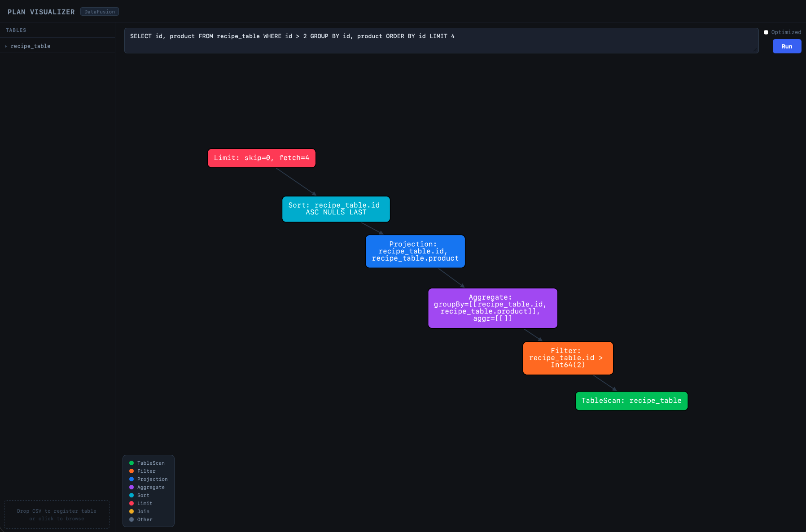

# DataFusion Plan Visualizer

An interactive web application for visualizing query plans produced by [Apache DataFusion](https://datafusion.apache.org/). Write SQL against uploaded tables and inspect how DataFusion's query planner decomposes it into a tree of relational operators — across all four plan representations.

**Live demo:** [datafusion-plan-visualizer.vercel.app](https://datafusion-plan-visualizer.vercel.app)



---

## Features

- **Four plan modes** — switch between Logical, Optimized, Physical, and Diff with a single click
- **Physical plan** — inspect the actual runtime execution operators DataFusion will use, including partitioning, hash joins, coalesce batches, and file-level push-downs not visible in the logical plan
- **Diff view** — side-by-side comparison of the unoptimized and optimized logical plans with node-level annotations: added, removed, modified, and unchanged operators are each highlighted with distinct border colors
- **Node detail panel** — click any node to reveal a slide-up panel showing the operator's full output schema as typed, nullable-annotated chips
- **Node tooltips** — hover over any node to see its full label without cluttering the graph
- **Color-coded operators** — each node type (Scan, Filter, Projection, Aggregate, Sort, Limit, Join, Repartition, CoalesceBatches) has a distinct color; physical operators map to the same palette by stripping the `Exec` suffix
- **Query history** — up to 20 recent queries are persisted in `localStorage`; clicking a history entry restores the SQL and plan mode and re-runs it immediately
- **Live table registry** — sidebar lists every registered table with its full Arrow schema, expandable per-table column view
- **Table deletion** — remove any table directly from the sidebar with a single click
- **Multi-format file upload** — drag-and-drop or click-to-browse for CSV, NDJSON, and Apache Avro files; re-uploading a file with the same name replaces the existing table
- **CSV validation** — headers are checked for blanks and duplicates, and a Parquet round-trip is attempted on a sample before anything is written to disk
- **Table persistence** — all registered tables (Parquet, JSON, Avro) are automatically re-registered on server restart

---

## Technologies

| Layer | Technology | Role |
|---|---|---|
| Query engine | [Apache DataFusion](https://datafusion.apache.org/) | SQL parsing, logical planning, optimization, physical planning |
| Columnar format | [Apache Parquet](https://parquet.apache.org/) via [PyArrow](https://arrow.apache.org/docs/python/) | On-disk table storage for CSV uploads |
| Data wrangling | [pandas](https://pandas.pydata.org/) | CSV ingestion and Parquet conversion |
| API server | [FastAPI](https://fastapi.tiangolo.com/) + [Uvicorn](https://www.uvicorn.org/) | Async HTTP layer, file upload handling |
| Graph rendering | [Cytoscape.js](https://js.cytoscape.org/) | DAG layout and interactive visualization |
| Deployment | [Vercel](https://vercel.com/) | Serverless hosting |
| Package manager | [uv](https://docs.astral.sh/uv/) | Fast Python dependency and environment management |
| Type checker | [ty](https://github.com/astral-sh/ty) | Static type analysis |

---

## Project Structure

```
datafusion_plan_visualizer/
├── engine/                  # DataFusion wrapper library
│   ├── __init__.py          # Public API re-exports
│   ├── context.py           # Session context, table registration (CSV/JSON/Avro), catalog queries, bootstrap
│   ├── query.py             # SQL execution
│   └── plan.py              # Logical/physical plan extraction, Cytoscape.js serialization, diff algorithm
├── server/                  # FastAPI web server
│   ├── app.py               # Application factory, static file mount, lifespan bootstrap
│   └── routes.py            # Route handlers: GET /, GET /tables, POST /tables, DELETE /tables/{name}, POST /plan
├── static/                  # Front-end assets
│   ├── index.html           # Markup and styles
│   └── js/
│       └── main.js          # Cytoscape setup, plan/diff rendering, mode selector, history, table sidebar, file upload
├── data/                    # Source files and generated Parquet/JSON/Avro files
│   └── test.csv
└── pyproject.toml
```

---

## Architecture

```
Browser
  │  GET /              → index.html
  │  GET /tables        → [{name, columns[]}]
  │  POST /tables       → file upload → [{name, columns[]}]
  │  DELETE /tables/:n  → [{name, columns[]}]
  │  POST /plan         → {sql, plan_type} → {type, elements[]} or {type, left[], right[]}
  ▼
FastAPI (server/app.py)
  │
  ├── routes.py
  │     ├── list_tables()    → engine.get_tables()
  │     ├── upload_table()   → engine.register_csv/json/avro()
  │     ├── delete_table()   → engine.deregister_table()
  │     └── get_plan()       → engine.query() → engine.plan/physical_plan() → cytoscape serialization
  │
  └── engine/
        ├── context.py       # Singleton SessionContext; register_csv/json/avro, deregister_table, get_tables, bootstrap
        ├── query.py         # context.sql(statement) → DataFrame
        └── plan.py          # plan/physical_plan extraction → DFS traversal → Cytoscape node/edge list
                             # diff_logical_plans → SequenceMatcher diff annotation
```

**Data flow for a plan request:**

1. Browser sends `POST /plan` with `{"sql": "SELECT …", "plan_type": "logical"|"optimized"|"physical"|"diff"}`
2. `routes.get_plan` calls `engine.query(sql)` → DataFusion returns a lazy `DataFrame`
3. For logical/optimized: `engine.plan(df, optimized=...)` → `LogicalPlan` tree → `plan_to_cytoscape` walks via `node.inputs()`, parses output schemas from the graphviz representation, and returns `{"type": "single", "elements": [...]}`
4. For physical: `engine.physical_plan(df)` → `ExecutionPlan` tree → `physical_plan_to_cytoscape` walks via `node.children()`
5. For diff: both unoptimized and optimized logical plans are serialized, then `difflib.SequenceMatcher` compares the DFS-ordered label sequences and annotates each node as `added`, `removed`, `modified`, or `unchanged`; returns `{"type": "diff", "left": [...], "right": [...]}`
6. Cytoscape.js in the browser applies a breadth-first hierarchical layout and, for diff mode, renders the left/right panels side by side with border-color data selectors

**Data flow for file registration:**

1. Browser sends `POST /tables` with the file as multipart form data
2. `routes.upload_table` writes the upload to a temporary path and dispatches by extension:
   - `.csv` → `register_csv`: validates headers and Parquet round-trip, converts via pandas, writes `.parquet` to `data/`
   - `.json` → `register_json`: copies NDJSON file to `data/`, calls `context.register_json`
   - `.avro` → `register_avro`: copies Avro file to `data/`, calls `context.register_avro`
3. All registration functions deregister any existing table with the same name first (idempotent re-upload)
4. `engine.get_tables` queries the live DataFusion catalog and returns the updated schema list

---

## Requirements

- Python 3.13+
- [uv](https://docs.astral.sh/uv/) (`pip install uv` or see [uv installation docs](https://docs.astral.sh/uv/getting-started/installation/))

---

## Installation

```bash
git clone <repo-url>
cd datafusion_plan_visualizer
uv sync
```

---

## Usage

### Start the server

```bash
uv run uvicorn server.app:app --reload
```

Open [http://localhost:8000](http://localhost:8000).

### Explore a query plan

1. Type a SQL query in the editor (the default table `test` is pre-registered)
2. Press **Run** or `Cmd/Ctrl + Enter`
3. Select a plan mode from the segmented control:
   - **Logical** — unoptimized plan as produced by the SQL parser
   - **Optimized** — optimizer-rewritten plan (predicate pushdown, projection pruning, etc.)
   - **Physical** — actual execution operators including partitioning and runtime decisions
   - **Diff** — side-by-side logical plans with node-level change annotations

### Inspect a node

Click any node in the graph to open the detail panel at the bottom of the screen. It shows the operator type, its full label, and its output schema as typed, nullable-annotated chips.

### Query history

Click **History** to open a dropdown of your last 20 queries. Clicking any entry restores the SQL and plan mode and immediately re-runs it.

### Register a new table

Drag a CSV, NDJSON, or Avro file onto the **"Drop CSV, JSON, or Avro"** zone in the sidebar, or click the zone to open a file picker. The table is available for querying immediately after upload. Re-uploading a file with the same name replaces the existing table.

### Remove a table

Hover over a table name in the sidebar and click the **✕** button that appears.

### API reference

Interactive docs are available at [http://localhost:8000/docs](http://localhost:8000/docs).

| Method | Path | Body / Params | Description |
|---|---|---|---|
| `GET` | `/` | — | SPA entry point |
| `GET` | `/tables` | — | List registered tables and schemas |
| `POST` | `/tables` | `file` (multipart) | Register a CSV, JSON, or Avro file as a new table |
| `DELETE` | `/tables/{name}` | — | Deregister a table and delete its backing file |
| `POST` | `/plan` | `{sql, plan_type}` | Return the plan for a SQL query as Cytoscape.js elements |

---

## Practical Applications

- **Learning SQL internals** — see exactly how a `GROUP BY`, `JOIN`, or subquery is decomposed before execution
- **Query optimization debugging** — use Diff mode to see precisely which operators the optimizer added, removed, or rewrote (predicate pushdown, projection pruning, join reordering, etc.)
- **Physical plan inspection** — understand runtime decisions like partitioning strategy, hash join vs. sort-merge join, and coalesce batches that are invisible in the logical plan
- **DataFusion development** — inspect custom logical plans or verify that optimizer rules are being applied correctly
- **Education and talks** — a visual alternative to `EXPLAIN` output for teaching relational algebra and query planning concepts

---

## References

- [Apache DataFusion documentation](https://datafusion.apache.org/)
- [DataFusion Python bindings](https://datafusion.apache.org/python/index.html)
- [Cytoscape.js documentation](https://js.cytoscape.org/)
- [FastAPI documentation](https://fastapi.tiangolo.com/)
- [Apache Arrow columnar format](https://arrow.apache.org/docs/format/Columnar.html)
- [Volcano/Iterator model — the foundation of DataFusion's execution model](https://doi.org/10.1145/93605.98720)
- [The Cascades Framework for Query Optimization](https://www.cse.iitb.ac.in/infolab/Data/Courses/CS632/Papers/Cascades-graefe.pdf)
